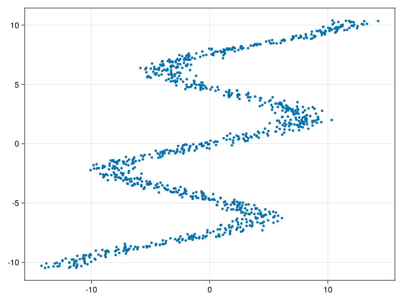
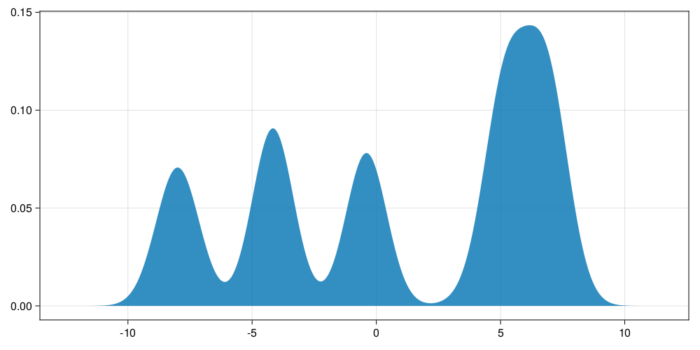

```@meta
CurrentModule = MixtureDensityNetworks
```

# MixtureDensityNetworks

Mixture Density Networks (MDNs) were first proposed by [Bishop (1994)](https://publications.aston.ac.uk/id/eprint/373/1/NCRG_94_004.pdf). We can think of them as a specialized type of neural network, which are typically employed when our data has a lot of uncertainty or when the relationship between features and labels is one-to-many. Unlike a traditional neural network, which predicts a point-estimate equal to the mode of the learned conditional distribution P(Y|X), an MDN maintains the full condtional distribution by predicting the parameters of a Gaussian Mixture Model (GMM). The multi-modal nature of GMMs are precisely what makes MDNs so well-suited to modeling one-to-many relationships. This package aims to provide a simple interface for defining, training, and deploying MDNs.

## Example

First, let's create our dataset. To properly demonstrate the power of MDNs, we'll generate a many-to-one dataset where each x-value can map to more than one y-value.
```julia
using Distributions, CairoMakie, MixtureDensityNetworks

const n_samples = 1000

Y = rand(Uniform(-10.5, 10.5), 1, n_samples)
μ = 7sin.(0.75 .* Y) + 0.5 .* Y
X = rand.(Normal.(μ, 1.0))

fig, ax, plt = scatter(X[1,:], Y[1,:], markersize=5)
```



Now we'll define our model and training parameters. For this example, we construct a network with 2 hidden layers of size 128, 5 Gaussian 
mixtures, and we train for 1000 epochs. All other hyperparameters are set to their default values.
```julia
model = MDN(epochs=1000, mixtures=5, layers=[128, 128])
```

We can fit our model to our training data by calling `fit!(model, X, Y)`. This method returns the learning curve, which we plot below.
```julia
lc = fit!(model, X, Y)
fig, _, _ = lines(1:1000, lc, axis=(;xlabel="Epochs", ylabel="Loss"))
```


Let's evaluate how well our model learned to replicate our data by plotting both the learned and true distributions. We observe that our model
has indeed learned to replicate the true distribution.
```julia
Ŷ = predict(model, X)
fig, ax, plt = scatter(X[1,:], rand.(Ŷ), markersize=3, label="Predicted Distribution")
scatter!(ax, X[1,:], Y[1,:], markersize=3, label="True Distribution")
axislegend(ax, position=:lt)
```


We can also visualize the conditional distribution predicted by our model at x = -2.0.
```julia
cond = predict(model, reshape([-2.0], (1,1)))[1]
fig = Figure(resolution=(1000, 500))
density(fig[1,1], rand(cond, 10000), npoints=10000)
```



Below is a script for running the complete example.
```julia
using MixtureDensityNetworks, Distributions, CairoMakie

const n_samples = 1000
const epochs = 1000
const mixtures = 5
const layers = [128, 128]

function main()
    # Generate Data
    Y = rand(Uniform(-10.5, 10.5), 1, n_samples)
    μ = 7sin.(0.75 .* Y) + 0.5 .* Y
    X = rand.(Normal.(μ, 1.0))

    # Create Model
    model = MDN(epochs=epochs, mixtures=mixtures, layers=layers)

    # Fit Model
    lc = fit!(model, X, Y)

    # Plot Learning Curve
    fig, _, _ = lines(1:epochs, lc, axis=(;xlabel="Epochs", ylabel="Loss"))
    save("LearningCurve.png", fig)

    # Plot Learned Distribution
    Ŷ = predict(model, X)
    fig, ax, plt = scatter(X[1,:], rand.(Ŷ), markersize=4, label="Predicted Distribution")
    scatter!(ax, X[1,:], Y[1,:], markersize=3, label="True Distribution")
    axislegend(ax, position=:lt)
    save("PredictedDistribution.png", fig)

    # Plot Conditional Distribution
    cond = predict(model, reshape([-2.0], (1,1)))[1]
    fig = Figure(resolution=(1000, 500))
    density(fig[1,1], rand(cond, 10000), npoints=10000)
    save("ConditionalDistribution.png", fig)
end

main()
```

## Index

```@index
```

## API

```@autodocs
Modules = [MixtureDensityNetworks]
Private = false
```