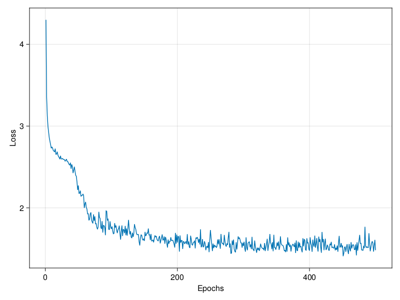

```@meta
CurrentModule = MixtureDensityNetworks
```

# MixtureDensityNetworks

This package provides a simple interface for defining, training, and deploying Mixture Density Networks (MDNs). MDNs were first proposed by [Bishop (1994)](https://publications.aston.ac.uk/id/eprint/373/1/NCRG_94_004.pdf). We can think of an MDN as a specialized type of Artificial Neural Network (ANN), which takes some features `X` and returns a distribution over the labels `Y` under a Gaussian Mixture Model (GMM). Unlike an ANN, MDNs maintain the full conditional distribution P(Y|X). This makes them particularly well-suited for situations where we want to maintain some measure of the uncertainty in our predictions. Moreover, because GMMs can represent multimodal distributions, MDNs are capable of modelling one-to-many relationships, which occurs when each input `X` can be associated with more than one output `Y`. 

# Example

First, let's create our dataset. To properly demonstrate the power of MDNs, we'll generate a many-to-one dataset where each x-value can map to more than one y-value.
```julia
using Distributions, CairoMakie, MixtureDensityNetworks

const n_samples = 1000

X, Y = generate_data(n_samples)

fig, ax, plt = scatter(X[1,:], Y[1,:], markersize=5)
```


Now we'll define our model and training parameters. For this example, we construct a network with 2 hidden layers of size 128, 5 Gaussian 
mixtures, and we train for 1000 epochs. All other hyperparameters are set to their default values.
```julia
model = MDN(epochs=1000, mixtures=5, layers=[128, 128])
```

We can fit our model to our training data by calling `fit!(model, X, Y)`. This method returns the learning curve, which we plot below.
```julia
lc = fit!(model, X, Y)
fig, _, _ = lines(1:1000, lc, axis=(;xlabel="Epochs", ylabel="Loss"))
```



Let's evaluate how well our model learned to replicate our data by plotting both the learned and true distributions. We observe that our model
has indeed learned to replicate the true distribution.
```julia
Ŷ = predict(model, X)
fig, ax, plt = scatter(X[1,:], rand.(Ŷ), markersize=3, label="Predicted Distribution")
scatter!(ax, X[1,:], Y[1,:], markersize=3, label="True Distribution")
axislegend(ax, position=:lt)
```


We can also visualize the conditional distribution predicted by our model at x = -2.0.
```julia
cond = predict(model, reshape([-2.0], (1,1)))[1]
fig = Figure(resolution=(1000, 500))
density(fig[1,1], rand(cond, 10000), npoints=10000)
```


Below is a script for running the complete example.
```julia
using MixtureDensityNetworks, Distributions, CairoMakie, Logging, TerminalLoggers

const n_samples = 1000
const epochs = 1000
const mixtures = 6
const layers = [128, 128]

function main()
    # Generate Data
    X, Y = generate_data(n_samples)

    # Create Model
    machine = MixtureDensityNetworks.Machine(MDN(epochs=epochs, mixtures=mixtures, layers=layers))

    # Fit Model
    report = with_logger(TerminalLogger()) do 
        fit!(machine, X, Y)
    end

    # Plot Learning Curve
    fig, _, _ = lines(1:epochs, report.learning_curve, axis=(;xlabel="Epochs", ylabel="Loss"))
    save("LearningCurve.png", fig)

    # Plot Learned Distribution
    Ŷ = predict(machine, X)
    fig, ax, plt = scatter(X[1,:], rand.(Ŷ), markersize=4, label="Predicted Distribution")
    scatter!(ax, X[1,:], Y[1,:], markersize=3, label="True Distribution")
    axislegend(ax, position=:lt)
    save("PredictedDistribution.png", fig)

    # Plot Conditional Distribution
    cond = predict(machine, reshape([-2.0], (1,1)))[1]
    fig = Figure(resolution=(1000, 500))
    density(fig[1,1], rand(cond, 10000), npoints=10000)
    save("ConditionalDistribution.png", fig)
end

main()
```